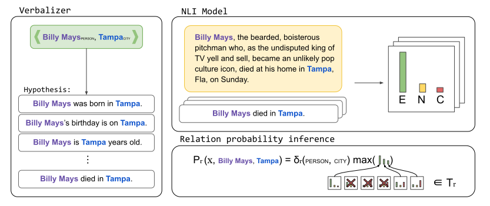

<h1 align="center">Ask2Transformers</h1>
<h3 align="center">A Framework for Textual Entailment based Zero Shot text classification</h3>
<p align="center">
 <a href="https://paperswithcode.com/sota/domain-labelling-on-babeldomains?p=ask2transformers-zero-shot-domain-labelling">
  
 </a>
</p>

This repository contains the code for out of the box ready to use zero-shot classifiers among different tasks, such as Topic Labelling or Relation Extraction. It is built on top of 🤗 HuggingFace [Transformers](https://github.com/huggingface/transformers) library, so you are free to choose among hundreds of models. You can either, use a dataset specific classifier or define one yourself with just labels descriptions or templates! The repository contains the code for the following publications:

- 📄 [Ask2Transformers - Zero Shot Domain Labelling with Pretrained Transformers](https://aclanthology.org/2021.gwc-1.6/) accepted in [GWC2021](http://globalwordnet.org/global-wordnet-conferences-2/).
- 📄 [Label Verbalization and Entailment for Effective Zero- and Few-Shot Relation Extraction](https://aclanthology.org/2021.emnlp-main.92/) accepted in [EMNLP2021](https://2021.emnlp.org/)

<!-- ### Supported (and benchmarked) tasks:
Follow the links to see some examples of how to use the library on each task.
- [Topic classification](./a2t/topic_classification/) evaluated on BabelDomains (Camacho-
Collados and Navigli, 2017)  dataset.
- [Relation classification](./a2t/relation_classification/) evaluated on TACRED (Zhang et al., 2017) dataset. -->

To get started with the repository consider reading the **new** [documentation](https://osainz59.github.io/Ask2Transformers)!


## Instalation

By using Pip (check the last release)

```shell script
pip install a2t
```

Or by clonning the repository

```shell script
git clone https://github.com/osainz59/Ask2Transformers.git
cd Ask2Transformers
python -m pip install .
```

[//]: 


## Available models
By default, `roberta-large-mnli` checkpoint is used to perform the inference. You can try different models to perform the zero-shot classification, but they need to be finetuned on a NLI task and be compatible with the `AutoModelForSequenceClassification` class from Transformers. For example:

* `roberta-large-mnli`
* `joeddav/xlm-roberta-large-xnli`
* `facebook/bart-large-mnli`
* `microsoft/deberta-v2-xlarge-mnli` 

**Coming soon:** `t5-large` like generative models support.

## Training your own models
There is no special script for fine-tuning your own entailment based models. In our experiments, we have used the publicly available [run_glue.py](https://github.com/huggingface/transformers/blob/master/examples/pytorch/text-classification/run_glue.py) python script (from HuggingFace Transformers). To train your own model, first, you will need to convert your actual dataset in some sort of NLI data, we recommend you to have a look to [tacred2mnli.py](https://github.com/osainz59/Ask2Transformers/blob/master/scripts/tacred2mnli.py) script that serves as an example.

## Results

To obtain the results reported here run the [`evaluation.py`](./a2t/evaluation.py) script with the corresponding configuration [files](./resources/predefined_configs/). 

### Topic Labelling (BabelDomains)

| Method | Precision | Recall | F1-Score |
|:------:|:---------:|:------:|:--------:|
| Distributional (Camacho-Collados et al. 2016) | 84.0 | 59.8 | 69.9 |
| BabelDomains (Camacho-Collados et al. 2017)   | 81.7 | 68.7 | 74.6 |
| | | | |
| NLI <span style="font-size:75%">RoBERTa</span> | **92.14** | **92.14** | **92.14** |

### Relation Extraction (TACRED)

The training (and development) splits can be found in the [resources](./resources/) directory.

| Method | 0% | 1% | 5% | 10% | 100% |
|:------:|:----:|:---------:|:------:|:--------:|:----------:|
| SpanBERT | - | 0.0±<small>0.0</small> | 28.8±<small>13.5</small> | 1.6±<small>20.7 | 70.8 |
| RoBERTa | - | 7.7±<small>3.6</small> | 41.8±<small>3.3</small> | 55.1±<small>0.8</small> | 71.3 |
| K-Adapter | - | 13.8±<small>3.4</small> | 45.1±<small>0.1</small> | 56.0±<small>1.3</small> | 72.0 |
| LUKE | - | 17.0±<small>5.9</small> | 51.6±<small>0.4</small> | 60.6<small>0.4</small> | 72.7 |
| | | | |
| NLI <span style="font-size:75%">RoBERTa</span> | 55.6±<small>1.3</small> | 56.1±<small>0.0</small> | 64.1±<small>0.2</small> | 67.8±<small>0.2</small> | 71.0 |
| NLI <span style="font-size:75%">DeBERTa</span> | **62.8**±<small>1.7</small> | **63.7**±<small>0.0</small> | **69.0**±<small>0.2</small> | **67.9**±<small>0.5</small> | **73.9** |

## About legacy code

The old code of this repository has been moved to [`a2t.legacy`](./a2t/legacy/) module and is only intended to be use for experimental reproducibility. Please, consider moving to the new code. If you need help read the new [documentation](https://osainz59.github.io/Ask2Transformers) or post an Issue on GitHub.

## Citation
Cite this paper if you want to cite stuff related to Relation Extraction, etc.
```bibtex
@inproceedings{sainz-etal-2021-label,
    title = "Label Verbalization and Entailment for Effective Zero and Few-Shot Relation Extraction",
    author = "Sainz, Oscar  and
      Lopez de Lacalle, Oier  and
      Labaka, Gorka  and
      Barrena, Ander  and
      Agirre, Eneko",
    booktitle = "Proceedings of the 2021 Conference on Empirical Methods in Natural Language Processing",
    month = nov,
    year = "2021",
    address = "Online and Punta Cana, Dominican Republic",
    publisher = "Association for Computational Linguistics",
    url = "https://aclanthology.org/2021.emnlp-main.92",
    pages = "1199--1212",
    abstract = "Relation extraction systems require large amounts of labeled examples which are costly to annotate. In this work we reformulate relation extraction as an entailment task, with simple, hand-made, verbalizations of relations produced in less than 15 min per relation. The system relies on a pretrained textual entailment engine which is run as-is (no training examples, zero-shot) or further fine-tuned on labeled examples (few-shot or fully trained). In our experiments on TACRED we attain 63{\%} F1 zero-shot, 69{\%} with 16 examples per relation (17{\%} points better than the best supervised system on the same conditions), and only 4 points short to the state-of-the-art (which uses 20 times more training data). We also show that the performance can be improved significantly with larger entailment models, up to 12 points in zero-shot, allowing to report the best results to date on TACRED when fully trained. The analysis shows that our few-shot systems are specially effective when discriminating between relations, and that the performance difference in low data regimes comes mainly from identifying no-relation cases.",
}
``` 

Cite this paper if you want to cite stuff related with topic labelling (A2TDomains or our paper results).
```bibtex
@inproceedings{sainz-rigau-2021-ask2transformers,
    title = "{A}sk2{T}ransformers: Zero-Shot Domain labelling with Pretrained Language Models",
    author = "Sainz, Oscar  and
      Rigau, German",
    booktitle = "Proceedings of the 11th Global Wordnet Conference",
    month = jan,
    year = "2021",
    address = "University of South Africa (UNISA)",
    publisher = "Global Wordnet Association",
    url = "https://www.aclweb.org/anthology/2021.gwc-1.6",
    pages = "44--52",
    abstract = "In this paper we present a system that exploits different pre-trained Language Models for assigning domain labels to WordNet synsets without any kind of supervision. Furthermore, the system is not restricted to use a particular set of domain labels. We exploit the knowledge encoded within different off-the-shelf pre-trained Language Models and task formulations to infer the domain label of a particular WordNet definition. The proposed zero-shot system achieves a new state-of-the-art on the English dataset used in the evaluation.",
}
```
