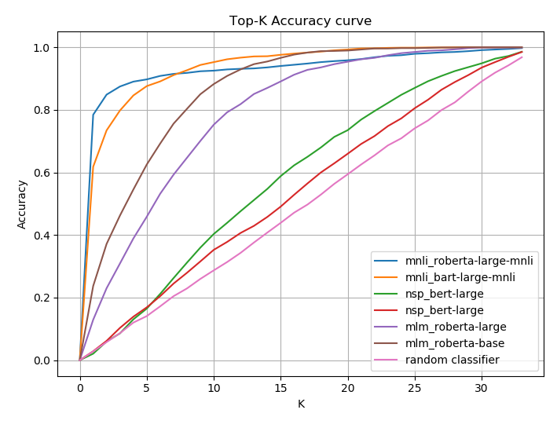

# Ask2Transformers - Zero Shot Topic Classification with Pretrained Transformers

Work in progress.

This library contains the code for the Ask2Transformers project.


## Topic classification just with non task specific pretrained models

```python
>>> from topic_classification.mnli import NLITopicClassifier
>>> topics = ['politics', 'culture', 'economy', 'biology', 'legal', 'medicine', 'business']
>>> context = "hospital: a health facility where patients receive treatment."

>>> clf = NLITopicClassifier('roberta-large-mnli', topics)

>>> predictions = clf(context)[0]
>>> print(sorted(list(zip(predictions, topics)), reverse=True))

[(0.77885467, 'medicine'),
 (0.08395168, 'biology'),
 (0.040319894, 'business'),
 (0.027866213, 'economy'),
 (0.02357693, 'politics'),
 (0.023382403, 'legal'),
 (0.02204825, 'culture')]

```

## WordNet Dataset (BabelNet Domains)

- 1540 annotated glosses
- 34 domains (classes)

Results (Micro-average):
| Method | Precision | Recall | F1-Score |
|:------:|:---------:|:------:|:--------:|
| Distributional (Camacho-Collados et al. 2016) | 84.0 | 59.8 | 69.9 |
| BabelDomains (Camacho-Collados et al. 2017)   | 81.7 | 68.7 | 74.6 |
| | | | |
| Ask2Transformers | **92.14** | **92.14** | **92.14** |


### Approach evaluation

Next table shows the weighted averaged Precision, Recall and F1-Score along with Top-1, Top-3 and Top-5 Accuracy of each of the implemented approaches.

| Method | Precision | Recall | F1-Score | Top-1 | Top-3 | Top-5 |
|:------:|:---------:|:------:|:--------:|:-----:|:-----:|:-----:|
| MNLI (roberta-large-mnli) | **91.6** | **78.44** | **82.4** | **78.44** | **87.46** | **89.74** |
| MNLI (bart-large-mnli) | 85.63 | 61.81 | 66.38 | 61.81 | 79.85 | 87.59 |
| NSP (bert-large-uncased) | 49.78 | 2.07 | 2.83 | 2.07 | 8.57 | 16.49 |
| NSP (bert-base-uncased) | 18.59 | 2.85 | 1.84 | 2.85 | 10.32 | 16.88 |
| MLM (roberta-large) | 71.21 | 12.92 | 16.24 | 12.91 | 30.9 | 45.84 |
| MLM (roberta-base)  | 67.74 | 23.7 | 32.35 | 23.7 | 46.23 | 62.53 |



### MNLI Query phrase exploration

Next table shows the weighted averaged Precision, Recall and F1-Score along with Top-1, Top-3 and Top-5 Accuracy of the MNLI (roberta-large-mnli) system with different query phrases.

| Query Phrase | Precision | Recall | F1-Score | Top-1 | Top-3 | Top-5 |
|:-------|:---------:|:------:|:--------:|:-----:|:-----:|:-----:|
| "Topic: " | 89.36 | 59.61 | 66.88 | 59.61 | 69.48 | 74.02 |
| "Domain: " | 89.62 | 58.50 | 65.98 | 58.50 | 67.40 | 72.27 |
| "Theme: " | 90.28 | 59.67 | 67.08 | 59.67 | 73.96 | 81.36 |
| "Subject: " | 89.83 | 60.58 | 67.65 | 60.58 | 69.74 | 74.35 |
| "Is about " | 91.54 | 73.37 | 79.15 | 73.37 | 87.72 | 91.94 |
| "Topic or domain about "  | 91.6 | 78.44 | 82.4 | 78.44 | 87.46 | 89.74 |
| "The topic of the sentence is about "  | 92.02 | 80.71 | 84.79 | 80.71 | 92.92 | 95.77 |
| "The domain of the sentence is about "  | **92.20** | **81.62** | **85.44** | **81.62** | **93.96** | **96.42** |
| "The topic or domain of the sentence is about "  | 91.91 | 76.62 | 82.02 | 76.62 | 88.63 | 91.23 |

### Label mapping

Sometimes the defined labels are very general or very precise. For instance, the label "Art, architecture, and archaeology" is a composed label formed by "Art", "Architecture" and "Archeology" topics. That composition can derive in an unappropiate performance of the system when the "Art" topic appears but not the "Architecture" or "Archeology". That's why we decided to define a better set of labels for the system and map them to our actual ones. The way that we generate the new label set is the following: given a composed label, generate the new labels based on the topics that forms the label. Following that strategy and running the system again, we get the following performance:

|  | Precision | Recall | F1-Score | Top-1 | Top-3 | Top-5 |
|:-------|:---------:|:------:|:--------:|:-----:|:-----:|:-----:|
| Without mapping | 92.20 | 81.62 | 85.44 | 81.62 | 93.96 | 96.42 |
| Splitted labels | **96.51** | **92.14** | **93.88** | **92.14** | **98.18** | **99.02** |
