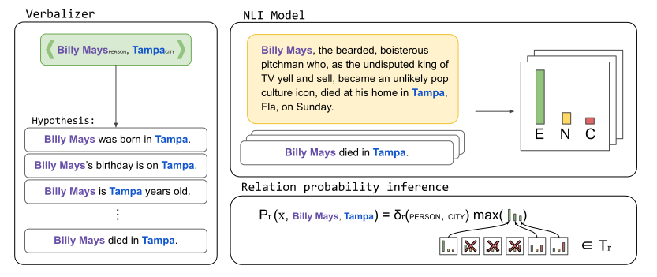

# Label verbalizations for Relation Classification



This repository contains the code for the work [Label Verbalization and Entailment for Effective Zero- and Few-Shot Relation Extraction](https://arxiv.org/abs/2109.03659) accepted in [EMNLP2021](https://2021.emnlp.org/).

On this work we explore how with few verbalization and restrinctions we can build a simple yet effective relation classifier. As shown in the image above the process consist in 3 steps:

1. Defining the relation verbalizations with simple templates.
2. Get a entailment probability for each of the generated templates.
3. Perform the inference based on entity type restrinctions and entailment probabilities.

Let's see an example:

```python
>>> from a2t.relation_classification import NLIRelationClassifierWithMappingHead

>>> # Define the set of relations we want to classify (including no_relation in the first position!)
>>> relations = [
        'no_relation',
        'per:city_of_death',
        'org:founded_by'
    ]
>>> # Define the verbalizations (a descriptive template) of each positive relation
>>> relation_verbalizations = {
        'per:city_of_death': [
            "{subj} died in {obj}"
        ],
        'org:founded_by': [
            "{subj} was founded by {obj}",
            "{obj} founded {subj}"
        ]
    }
>>> # Define the posible entity type combinations for each relation
>>> valid_conditions = {
        'per:city_of_death': [
            "PERSON:CITY",
            "PERSON:LOCATION"
        ],
        'org:founded_by': [
            "ORGANIZATION:PERSON"
        ]
    }
>>> # Define the classifier instance, by default the threshold is set to 0.95
>>> clf = NLIRelationClassifierWithMappingHead(
        labels=relations, 
        template_mapping=relation_verbalizations,
        valid_conditions=valid_conditions,
        negative_threshold=0.9
    )
``` 

Let's perform the inference over some TACRED dataset instances (copied from dataset [webpage](https://nlp.stanford.edu/projects/tacred/)):

```python
>>> from a2t.relation_classification import REInputFeatures

>>> test_examples = [
        REInputFeatures(subj='Billy Mays', obj='Tampa', pair_type='PERSON:CITY', context='Billy Mays, the bearded, boisterous pitchman who, as the undisputed king of TV yell and sell, became an unlikely pop culture icon, died at his home in Tampa, Fla, on Sunday', label='per:city_of_death'),
        REInputFeatures(subj='Old Lane Partners', obj='Pandit', pair_type='ORGANIZATION:PERSON', context='Pandit worked at the brokerage Morgan Stanley for about 11 years until 2005, when he and some Morgan Stanley colleagues quit and later founded the hedge fund Old Lane Partners.', label='org:founded_by'),
        REInputFeatures(subj='He', obj='University of Maryland in College Park', pair_type='PERSON:ORGANIZATION', context='He received an undergraduate degree from Morgan State University in 1950 and applied for admission to graduate school at the University of Maryland in College Park.', label='no_relation')

    ]

>>> clf.predict(test_examples, return_confidences=True, topk=1)
[('per:city_of_death', 0.9872344136238098), 
 ('org:founded_by', 0.9368535280227661), 
 ('no_relation', 1.0)]
```

In this case the classification problem is trivial, as there is only 1 single relation that fits the entity type restrinctions for each of the relations. Let's see how the model works when more relations are added. To do that we are going to test the predifined `TACREDClassifier`. **Note**: the default model for the `TACREDClassifier` is `microsoft/deberta-v2-xlarge-mnli` instead of `roberta-large-mnli`.

```python
>>> from a2t.relation_classification import TACREDClassifier

>>> clf = TACREDClassifier()

>>> clf.predict(test_examples, return_confidences=True, topk=3)
[
    [
        ('per:city_of_death', 0.9863594174385071), 
        ('per:cities_of_residence', 0.9615851044654846), 
        ('per:city_of_birth', 0.20450372993946075)
    ], 
    [
        ('org:founded_by', 0.982134222984314), 
        ('org:shareholders', 0.2112521231174469), 
        ('org:top_members/employees', 0.02117827534675598)
    ], 
    [
        ('no_relation', 1.0),
        ('per:schools_attended', 0.8616090416908264), 
        ('per:employee_of', 0.28163495659828186) 
    ]
]
```

## Evaluation

You can easily evaluate a model and verbalizations on TACRED dataset with the following command:

```shell script
python3 -m a2t.relation_classification.run_evaluation \
    path/to/tacred/data.json \
    --config path/to/config.json
```

And the configuration file should be a JSON that looks like:

```json
[
    {
        "name": "experiment_name",
        "classification_model": "mnli-mapping",
        "pretrained_model": "roberta-large-mnli",
        "batch_size": 1,
        "use_cuda": true,
        "half": true,
        "entailment_position": 0,
        "labels": [
            "no_relation",
            "org:alternate_names",
            ...
        ],
        "template_mapping": {
            "per:alternate_names": [
                "{subj} is also known as {obj}"
            ],
            "per:date_of_birth": [
                "{subj}'s birthday is on {obj}",
                "{subj} was born in {obj}"
            ],
            ...
        },
        "valid_conditions": {
            "per:alternate_names": [
                "PERSON:PERSON",
                "PERSON:MISC"
            ],
            "per:date_of_birth": [
                "PERSON:DATE"
            ],
            ...
        }

    },
    
]
```

You can find the labels, templates and valid conditions used for the TACRED dataset in [tacred.py](./tacred.py).

### Results (Micro F1 score)
Rows indicates the different models and columns the percentage of trainig data used for fine-tuning.

| Method | 0% | 1% | 5% | 10% | 100% |
|:------:|:----:|:---------:|:------:|:--------:|:----------:|
| SpanBERT | - | 0.0±<small>0.0</small> | 28.8±<small>13.5</small> | 1.6±<small>20.7 | 70.8 |
| RoBERTa | - | 7.7±<small>3.6</small> | 41.8±<small>3.3</small> | 55.1±<small>0.8</small> | 71.3 |
| K-Adapter | - | 13.8±<small>3.4</small> | 45.1±<small>0.1</small> | 56.0±<small>1.3</small> | 72.0 |
| LUKE | - | 17.0±<small>5.9</small> | 51.6±<small>0.4</small> | 60.6<small>0.4</small> | 72.7 |
| | | | |
| NLI <span style="font-size:75%">RoBERTa</span> | 55.6±<small>1.3</small> | 56.1±<small>0.0</small> | 64.1±<small>0.2</small> | 67.8±<small>0.2</small> | 71.0 |
| NLI <span style="font-size:75%">DeBERTa</span> | **62.8**±<small>1.7</small> | **63.7**±<small>0.0</small> | **69.0**±<small>0.2</small> | **67.9**±<small>0.5</small> | **73.9** |

The data splits for training and development are available at [resources/tacred_splits/](../../resources/tacred_splits/).

## Citation

```bibtex
@misc{sainz2021label,
      title={Label Verbalization and Entailment for Effective Zero- and Few-Shot Relation Extraction}, 
      author={Oscar Sainz and Oier Lopez de Lacalle and Gorka Labaka and Ander Barrena and Eneko Agirre},
      year={2021},
      eprint={2109.03659},
      archivePrefix={arXiv},
      primaryClass={cs.CL}
}
```
